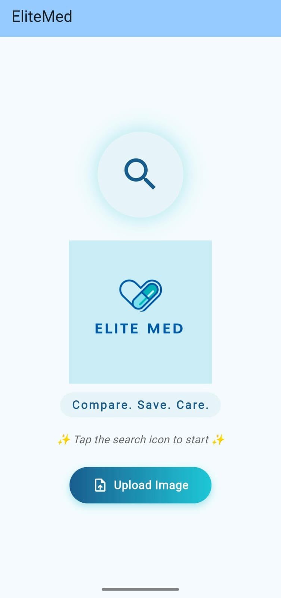
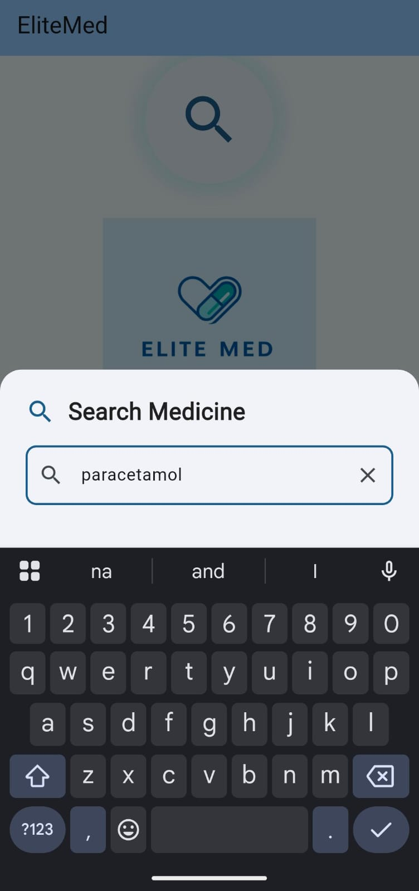
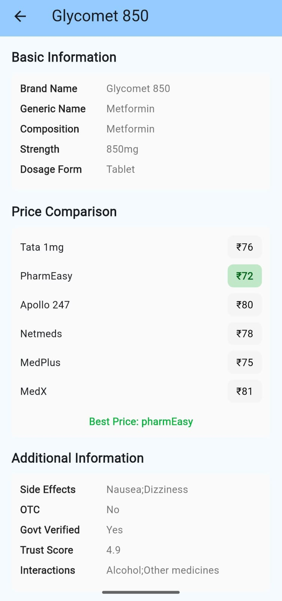

# 💊 EliteMed - Smart Medicine Price Comparison App

<div align="center">


**Compare. Save. Care.**

[](https://flutter.dev)
[](https://developers.google.com/ml-kit)
[](https://firebase.google.com)
[](https://ai.google.dev)

*Built for Google Developer Group (GDG) Hack Elite 2026*

</div>

---

## 🎯 About The Project

**EliteMed** is an intelligent medicine price comparison platform that empowers users to find the best deals on medicines across 6 major online pharmacies in India. Using cutting-edge Google technologies including ML Kit OCR and Gemini AI, EliteMed makes healthcare more affordable and accessible.

### ✨ Key Features

- 🔍 **Smart Search** - Search medicines by brand or generic name
- 📸 **OCR Scanner** - Upload medicine images to extract names using Google ML Kit
- 💰 **Price Comparison** - Compare prices across 6 platforms (Tata 1mg, PharmEasy, Apollo 247, Netmeds, MedPlus, MedX)
- 📊 **Best Price Detection** - Automatically identifies the cheapest option
- 📋 **Detailed Info** - View composition, strength, side effects, and interactions
- 🎨 **Modern UI** - Clean Material Design 3 interface with custom branding
- 🔥 **Firebase Analytics** - Track user behavior and app usage
- 🤖 **Gemini AI** - AI-powered medicine suggestions (integrated)

---

## 🚀 Google Technologies Used

This project leverages multiple Google technologies and services:

### 1. **Google ML Kit** ✅
- **Text Recognition v2 API** for OCR functionality
- Extracts medicine names from uploaded images
- Latin script recognition with high accuracy
- Real-time image processing

### 2. **Firebase Suite** ✅
- **Firebase Core** - Foundation for all Firebase services
- **Firebase Analytics** - User behavior tracking and insights
- **Firebase Crashlytics** - Real-time crash reporting and monitoring

### 3. **Google Generative AI (Gemini)** ✅
- **Gemini Pro model** integration
- AI-powered medicine recommendations
- Natural language query processing

### 4. **Flutter SDK** ✅
- Google's UI toolkit for cross-platform development
- Material Design 3 components
- Hot reload for rapid development

---

## 📱 Screenshots


| Home Screen | Search Results | Medicine Details |
|------------|----------------|------------------|
|  |  |  |

---

## 🛠️ Tech Stack

### Frontend
- **Flutter** 3.10.4
- **Dart** SDK
- Material Design 3

### Google Services
- Google ML Kit Text Recognition v2 (v0.13.1)
- Firebase Core (v2.24.2)
- Firebase Analytics (v10.8.0)
- Firebase Crashlytics (v3.4.9)
- Google Generative AI (v0.2.2)

### Additional Packages
- `image_picker` - Image selection from gallery
- `url_launcher` - Open pharmacy websites
- `flutter_launcher_icons` - Custom app icon generation

---

## 📦 Installation

### Prerequisites
- Flutter SDK (3.10.4 or higher)
- Android Studio / VS Code
- Android SDK (API Level 21+)
- Git

### Setup Instructions

1. **Clone the repository**
   ```bash
   git clone https://github.com/yourusername/elitemed.git
   cd elitemed
   ```

2. **Install dependencies**
   ```bash
   flutter pub get
   ```

3. **Configure Firebase** (Optional for full functionality)
   - Create a Firebase project at [Firebase Console](https://console.firebase.google.com)
   - Download `google-services.json` and place in `android/app/`
   - Update the configuration in `lib/main.dart`

4. **Add Gemini API Key** (Optional)
   - Get API key from [Google AI Studio](https://makersuite.google.com/app/apikey)
   - Replace `AIzaSyDemoKey_GDG_Hackathon` in `lib/main.dart`

5. **Run the app**
   ```bash
   flutter run
   ```

6. **Build APK**
   ```bash
   flutter build apk --release
   ```
   APK location: `build/app/outputs/flutter-apk/app-release.apk`

---

## 📖 Usage

### Search Medicine
1. Tap the search icon on the home screen
2. Enter medicine brand name or generic name
3. View search results with prices

### Upload Image (OCR)
1. Tap "Upload Image" button
2. Select medicine image from gallery
3. App automatically extracts medicine name using Google ML Kit
4. View search results

### Compare Prices
1. Select any medicine from search results
2. View detailed price comparison across 6 platforms
3. Best price is highlighted in green

---

## 📁 Project Structure

```
lib/
├── main.dart                 # Main app entry point with Firebase & Gemini integration
└── assets/
    ├── logo.png              # App logo
    └── medicines_dataset.json # Medicine database (100+ medicines)

android/
├── app/
│   ├── google-services.json  # Firebase configuration
│   ├── src/main/
│   │   ├── AndroidManifest.xml
│   │   └── res/values/google-services-strings.xml
│   └── build.gradle.kts      # App-level Gradle config
└── build.gradle.kts          # Project-level Gradle config

docs/
├── GOOGLE_TECH_INTEGRATION.md  # Google technologies documentation
└── GOOGLE_SERVICES_README.md   # Firebase setup guide
```

---

## 🎨 Design & Branding

### Color Palette
- **Primary Blue**: `#2E5C8A` - Trust and healthcare
- **Secondary Cyan**: `#5EC4D4` - Modern and clean
- **Background**: `#F5FBFD` - Light and airy

### Typography
- Material Design 3 fonts
- Custom letter spacing for brand identity

---

## 🔒 Privacy & Security

- No personal data collection
- All medicine data is stored locally
- Firebase Analytics anonymizes user data
- Crashlytics respects user privacy settings

---

## 🤝 Contributing

Contributions are welcome! Please follow these steps:

1. Fork the repository
2. Create a feature branch (`git checkout -b feature/AmazingFeature`)
3. Commit your changes (`git commit -m 'Add AmazingFeature'`)
4. Push to the branch (`git push origin feature/AmazingFeature`)
5. Open a Pull Request

---

## 🐛 Known Issues & Limitations

- Firebase and Gemini AI use demo credentials (update for production)
- Medicine database contains sample pricing data
- OCR works best with clear, well-lit images
- Some advanced Firebase features require configuration

---

## 👥 Team

**Team Name**: Hack Elite

---

### 👤 Kiruthika K
- **Role**: Firebase 
- **Contact**: kiruthikakk82005@gmail.com

---

### 👤 Thirumaran S L
- **Role**: Full Stack Flutter Developer
- **Contact**: mrmaran@protonmail.com

---

### 👤 Bharathy K
- **Role**: Full Stack Flutter Developer
- **Contact**: bharathykannan6@gmail.com 

---

### 👤 Ashajasmin
- **Role**: Firebase
- **Contact**: ashajasminkumar@gmail.com

---

## 🙏 Acknowledgments

- **Google Developer Group (GDG)** - For organizing Hack Elite 2026
- **Google** - For amazing ML Kit, Firebase, and Gemini AI technologies
- **Flutter Team** - For the excellent cross-platform framework
- **Medicine data sources** - Tata 1mg, PharmEasy, Apollo 247, Netmeds, MedPlus, MedX

---

<div align="center">

**Built with ❤️ using Google Technologies**


⭐ **Star this repo if you find it helpful!** ⭐

</div>
